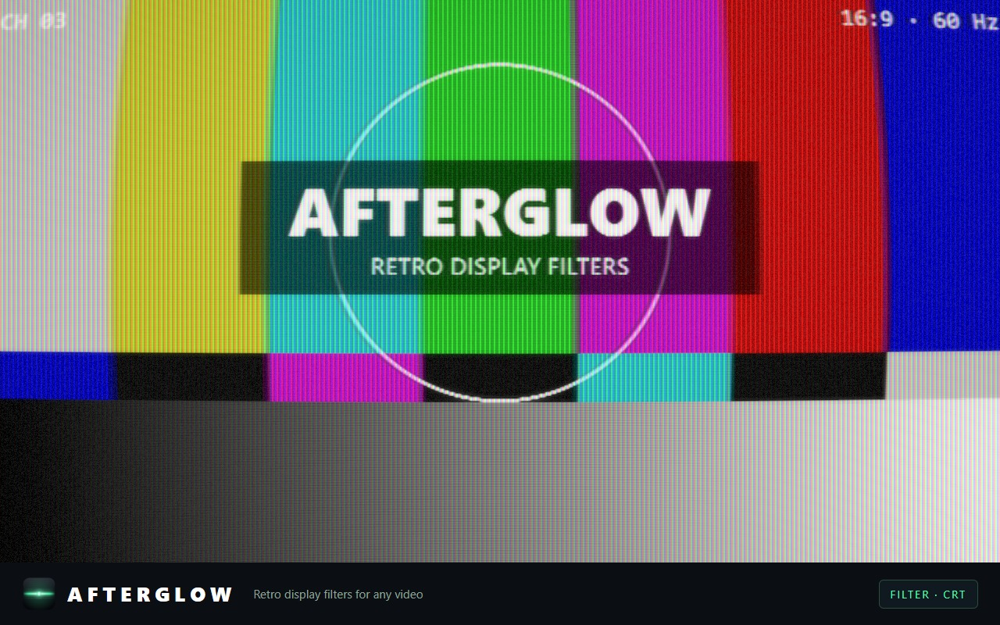

# Afterglow

Chrome extension (Manifest V3) that renders any `<video>` element through retro display shaders — CRT, Game Boy, Game Boy Color, Virtual Boy, PS1 — in real time with WebGL 1. No build step, no dependencies: plain JS, HTML, and GLSL ES 1.00.



## Architecture

Two rendering paths share the same shaders and uniform contract:

**Overlay path** (`content.js`) — for players that allow pixel reads. The popup injects `content.js` into the active tab via `chrome.scripting` + `activeTab` (there are no declared content scripts and no host permissions; the script only ever runs on tabs where the user invoked the extension, and guards against double injection). It finds the main `<video>`, mounts an absolutely-positioned WebGL canvas over it (`pointer-events: none`, tracked with a `ResizeObserver`), uploads the current frame with `texImage2D(video)` every rAF, and draws a fullscreen quad through the selected fragment shader.

**Capture path** (`viewer.html` / `viewer.js`) — for DRM players whose frames read back black. The popup requests a `tabCapture` stream id and opens the viewer in a new window, which consumes the stream via `getUserMedia({ chromeMediaSource: "tab" })` and renders it through the same pipeline. Keyboard and clicks on the viewer are forwarded back to the player tab as synthetic events (`CRT_REMOTE` messages → content script replays them), so player shortcuts keep working. Falls back to `getDisplayMedia` if the stream id is rejected.

### DRM detection

DRM frames read as pure black without throwing, so detection is heuristic (`content.js`):

1. **Pre-mount probe** — draw the video into a 4×4 2D canvas; if pixels are black, wait 700 ms and re-sample. Black *while `currentTime` advances* ⇒ DRM, don't mount.
2. **Deferred recheck** — enabling the filter on a *paused* protected video is undetectable (a paused black frame and a protected frame are byte-identical), so the overlay mounts and a self-removing `playing` listener re-probes ~700 ms into playback, tearing down if frames are still unreadable.
3. The result is sticky per page (`drmDetected`). The popup asks for it on open (`CRT_PROBE`) and, when true, disables the filter controls and points at Capture Mode.

### Message protocol

| Message | Direction | Purpose |
|---|---|---|
| `CRT_SET_SHADER` | popup → content | enable/disable + shader key |
| `CRT_PROBE` | popup → content | `{ hasVideo, drm }` for the popup UI |
| `CRT_MAXIMIZE_VIDEO` | popup → content | nudge the player toward fullscreen before capture |
| `CRT_REMOTE` | viewer → content | replay keyboard/clicks on the player tab |

### Shader contract

Fragment shaders are standalone GLSL ES 1.00 files in `src/shaders/`, hot-swappable at runtime:

```glsl
varying vec2 vUv;            // 0..1 quad coordinates
uniform sampler2D uVideo;    // current video frame (CLAMP_TO_EDGE, LINEAR)
uniform float uTime;         // seconds since activation
uniform vec2 uResolution;    // canvas size in px (matches video resolution)
```

User-defined shaders (popup → "ADD SHADER") are validated by compiling against a throwaway WebGL context before being stored in `chrome.storage.local`.

The CRT shader is the deep one: virtual low-res scanline source, brightness-dependent Gaussian beam, bandwidth-limited luma with delayed wide chroma, aperture grille fixed to `gl_FragCoord`, halation, radial misconvergence, edge defocus, curvature/overscan/vignette. Every parameter is a documented constant at the top of [`src/shaders/crt.frag.glsl`](src/shaders/crt.frag.glsl) — tune and hot-reload.

## Repo layout

```
src/                     the extension itself — Load unpacked points here
  manifest.json          MV3, permissions: activeTab, scripting, storage, tabCapture
  content.js             overlay path + DRM heuristics + remote-control replay
  popup.html / popup.js  TV-styled UI, on-demand injection, custom shader editor
  viewer.html / viewer.js  capture-mode window
  shaders/               vertex.glsl + one fragment shader per filter
  icons/                 toolbar/store icons
test/                    dev tooling (never shipped in the zip)
store-assets/            Chrome Web Store listing screenshots
.github/workflows/       CI: zip artifact, GitHub Release, Web Store publish
```

## Development

```
node test/server.js        # → http://localhost:8123/test/
```

Zero-dependency static server + hot-reloading test bench: it re-reads `src/shaders/*.glsl` from disk every 400 ms and recompiles on change, keeping the last good program and surfacing the compiler log on errors. Drop any frame at `test/test.png` to test against.

- `1-9` switch shaders · `space` freezes `uTime` · `O` overlays the original
- `?shader=name` adds any extra shader file as a channel
- `test/promo.html?shader=name` regenerates the 1280×800 store screenshots from a procedural test card

To run the extension itself: `chrome://extensions` → Developer mode → **Load unpacked** → select the `src/` folder. Shader edits need an extension reload; UI/JS edits too. That's why the test bench exists — iterate there, reload once.

## Release flow

Every push builds `afterglow-extension.zip` (extension files only) as an Actions artifact. Pushing a `vX.Y.Z` tag additionally:

1. stamps `X.Y.Z` into `src/manifest.json`,
2. attaches the zip to a GitHub Release,
3. uploads + submits to the Chrome Web Store via `chrome-webstore-upload-cli`, if the `CHROME_EXTENSION_ID` / `CHROME_CLIENT_ID` / `CHROME_CLIENT_SECRET` / `CHROME_REFRESH_TOKEN` secrets are set (skips gracefully otherwise).

## Privacy

Everything is local; nothing is collected or transmitted. See [PRIVACY.md](PRIVACY.md).

## License

[MIT](LICENSE)
